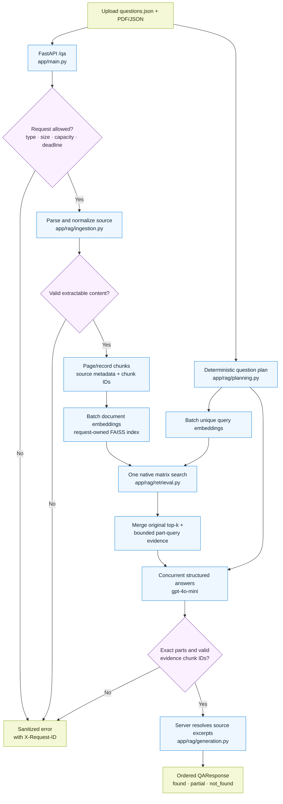
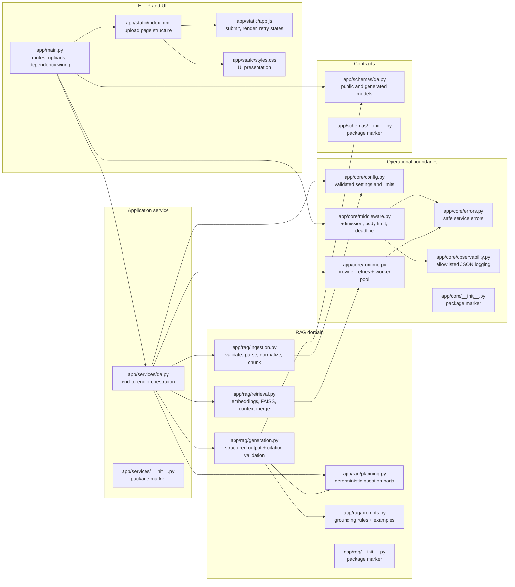

# Zania Document QA

A document-grounded question-answering service for PDF and JSON uploads. The API accepts a JSON
array of questions plus one source document, retrieves relevant evidence with OpenAI embeddings and
FAISS, and uses `gpt-4o-mini` to return structured answers with source-owned citations.

The repository includes:

- a FastAPI backend and minimal upload UI;
- deterministic question decomposition for explicit multipart questions;
- batched document/question embeddings and one native FAISS matrix search;
- `found`, `partial`, and `not_found` coverage states;
- server-resolved citation text—the model selects chunk IDs, not excerpts or page numbers;
- bounded uploads, concurrency, provider calls, retries, and request deadlines; and
- offline tests plus real-HTTP and container smoke tests in CI.

## Run with Docker

### Prerequisites

- Docker Desktop or Docker Engine with Compose v2
- An OpenAI API key with access to `text-embedding-3-small` and `gpt-4o-mini`

### 1. Configure the environment

From the repository root:

```bash
cp .env.example .env
```

Set `OPENAI_API_KEY` in `.env`. Do not commit the file or pass the key in an upload, screenshot, or
shell command. Docker Compose loads `.env` only at container runtime; `.dockerignore` prevents it
from entering the image.

### 2. Build and start the service

```bash
docker compose up --build
```

Compose builds a Python 3.12 image, runs the API as a non-root user, binds it to loopback, and uses
`/healthz` for the container health check.

### 3. Open the application

- Upload client: [http://127.0.0.1:8000/](http://127.0.0.1:8000/)
- Interactive API docs: [http://127.0.0.1:8000/docs](http://127.0.0.1:8000/docs)
- Health check: [http://127.0.0.1:8000/healthz](http://127.0.0.1:8000/healthz)

For a quick UI check, upload `examples/questions.json` and `examples/document.json`. A request to
`POST /qa` makes billable OpenAI calls. The UI, API docs, and health check work without a key, but
`POST /qa` returns `503` until one is configured.

To use another host port:

```bash
PORT=8001 docker compose up --build
```

To stop and remove the container and network:

```bash
docker compose down
```

## API

`POST /qa` accepts exactly two `multipart/form-data` file fields:

- `questions`: a `.json` file containing a nonempty array of nonblank strings;
- `document`: a `.pdf` with extractable text or a `.json` containing an object or array.

```bash
curl --fail-with-body http://127.0.0.1:8000/qa \
  -F 'questions=@examples/questions.json;type=application/json' \
  -F 'document=@examples/document.json;type=application/json'
```

Replace the document argument with
`-F 'document=@report.pdf;type=application/pdf'` to query a PDF.

A successful response preserves the submitted question order:

```json
{
  "results": [
    {
      "question": "Which cloud providers do you rely on?",
      "answer": "The production service is hosted on AWS.",
      "status": "found",
      "citations": [
        {
          "page": null,
          "excerpt": "The production service is hosted on AWS."
        }
      ]
    },
    {
      "question": "How frequently do you conduct penetration tests?",
      "answer": "Not found in document",
      "status": "not_found",
      "citations": []
    }
  ]
}
```

| Status | Meaning |
| --- | --- |
| `found` | Every planned part of the question is supported by retrieved evidence. |
| `partial` | Some requested information is supported, but at least one part is incomplete or missing. |
| `not_found` | No requested information is supported; the answer is exactly `Not found in document`. |

These states are model-assessed evidence coverage, not confidence scores. The server verifies that
citations are selected from retrieved source chunks, but that identity check alone does not prove
that every generated claim is semantically entailed by the cited text.

PDF citations use the one-based physical page position. JSON citations have `page: null` and refer
to deterministic JSON normalization: sorted keys, two-space indentation, preserved Unicode, and
precise decimal handling. Identical question strings are computed once and restored to their
original positions in the response.

Every response includes an `X-Request-ID` header. Errors use a sanitized JSON envelope:

```json
{
  "error": {
    "code": "missing_api_key",
    "message": "Set OPENAI_API_KEY in the environment or local .env file.",
    "request_id": "..."
  }
}
```

| HTTP status | Meaning |
| --- | --- |
| `413` | A byte, question, page, extracted-text, nesting, or chunk limit was exceeded. |
| `415` | The request or uploaded file type is unsupported. |
| `422` | The uploads are malformed, invalid, encrypted, empty, or contain no extractable text. |
| `502` | The provider response or selected evidence failed validation. |
| `503` | Configuration is missing, the provider is unavailable, or local capacity is full. |
| `504` | A provider or whole-request deadline was exceeded. |
| `500` | An unexpected failure occurred; internal exception details are not exposed. |

The request is all-or-nothing: a provider failure is not converted into `not_found`, and one failed
generation task cancels its sibling tasks.

## Architecture

### Request lifecycle



The orchestration sequence is intentionally explicit:

1. `RequestGuard` assigns a request ID, admits bounded work, buffers no more than the configured
   request limit, and applies the end-to-end deadline.
2. PDF pages or JSON records are normalized and split without crossing their source boundary.
3. The service embeds document chunks once and creates an in-memory FAISS index owned by that
   request.
4. A deterministic planner extracts only explicit question clauses or numbered choices. The same
   plan drives retrieval and the answer schema.
5. All unique query vectors are searched in one `store.index.search(matrix, k)` call. Each question
   keeps its original top `k`, then receives deduplicated part-query results up to `2k`.
6. One structured generation call runs per unique original question. Calls may run concurrently,
   while a process-wide semaphore bounds total provider work.
7. The server validates the exact part set and selected chunk IDs, resolves citations from its own
   chunks, and restores duplicate questions and original order.

### Source-file responsibilities

Every runtime source file is represented below. Arrows show the main dependency and control flow;
the `__init__.py` files are package markers only.



Supporting files are separated by purpose:

| Area | Files | Responsibility |
| --- | --- | --- |
| Containers | `Dockerfile`, `compose.yaml`, `.dockerignore` | Build and run the non-root production image without copying local secrets. |
| Python project | `pyproject.toml`, `requirements.txt`, `requirements-dev.txt` | Package metadata, compatible dependency ranges, and pinned runtime/development locks. |
| Local tooling | `Makefile`, `.env.example`, `scripts/doctor.py`, `scripts/benchmark_retrieval.py` | Optional local development checks, configuration template, diagnostics, and retrieval benchmark. |
| CI | `.github/workflows/ci.yml`, `.github/ci/e2e.sh`, `.github/ci/e2e_app.py` | Lint, tests, package build, real-HTTP deterministic-provider test, and container smoke test. |
| Tests | `tests/__init__.py`, `tests/conftest.py`, `tests/fakes.py`, `tests/pdf_factory.py`, `tests/test_*.py` | Mark the test package, block external sockets, provide deterministic providers/fixtures, and verify each boundary offline. |
| Examples | `examples/questions.json`, `examples/document.json`, `examples/appendix-questions.json`, `examples/Nave-SOC2-Type-2-Report.pdf` | Small synthetic demo plus the supplied SOC 2 evaluation fixture. |
| Review notes | `REVIEW.md`, `docs/NEXT_STEPS.md`, `docs/DESIRED_FEATURES.md` | Guided code review, measured follow-up work, and the unapproved JSON provenance design spike. |
| Repository/editor | `.gitignore`, `.vscode/settings.json`, `.vscode/extensions.json`, `grc-rag-agent.code-workspace` | Exclude local artifacts and provide optional editor defaults. |

### Architectural decisions

| Decision | Why it was chosen | Tradeoff |
| --- | --- | --- |
| Request-owned in-memory FAISS index | Keeps uploaded documents isolated, avoids persistence, and makes cleanup unambiguous. | Re-uploading the same document rebuilds embeddings and the index. |
| Deterministic question planning | Retrieval and generation share the same explicit part contract without an extra planner-model call. | The conservative parser handles explicit clauses/numbered items, not arbitrary linguistic decomposition. |
| Native batched FAISS search | All unique question/part vectors cross the Python/native boundary in one matrix search while preserving per-query ranking. | The measured speedup is retrieval-only; provider latency still dominates end-to-end time. |
| Structured generation per unique question | Exact part keys make missing/extra answers rejectable while isolating contexts and retries by question. | Several questions require several generation calls; they are bounded and concurrent rather than combined into one large prompt. |
| Model selects chunk IDs; server owns citation text | Prevents the model from inventing or reformatting quotes and page numbers. | Valid source identity is not the same as semantic entailment, so answer quality still needs evaluation. |
| Normalize PDF extractor whitespace before chunking | Prevents positioned-word newlines from polluting retrieval, model context, and displayed citations. | Words and punctuation are preserved, but table columns and visual layout are not reconstructed. |
| Bounded async I/O plus bounded worker threads | Provider calls stay concurrent while parsing, splitting, and FAISS work cannot exhaust the event loop or CPU pool. | Cancelled native/thread work cannot be forcibly stopped; limits reduce risk but are not hard process isolation. |
| No durable app persistence, LangSmith tracing, or content logging | Minimizes retention of compliance documents and keeps operational logs safe to inspect. | Multipart handling may spool uploads temporarily; OpenAI still receives chunk text for embeddings and retrieved evidence for generation. |

## Models and configuration

| Job | Model | Output |
| --- | --- | --- |
| Embed document chunks and retrieval queries | `text-embedding-3-small` by default; configurable with `EMBEDDING_MODEL` | Numeric vectors |
| Generate structured part answers and select evidence IDs | `gpt-4o-mini`; fixed in code | Structured answer fields and chunk IDs |

The answer-model restriction applies to answer generation; the embedding model performs semantic
retrieval and does not write answers.

Settings are validated in `app/core/config.py` and listed in `.env.example`:

| Setting | Default |
| --- | --- |
| `MAX_DOCUMENT_BYTES` | 10 MiB |
| `MAX_QUESTIONS_BYTES` | 128 KiB |
| `MAX_REQUEST_BYTES` | 11 MiB including multipart framing |
| `MAX_QUESTIONS` / `MAX_QUESTION_CHARS` | 50 / 2,000 |
| `MAX_PDF_PAGES` / `MAX_EXTRACTED_CHARS` | 200 / 1,000,000 |
| `MAX_CHUNKS` / `MAX_JSON_DEPTH` | 2,000 / 64 |
| `CHUNK_SIZE` / `CHUNK_OVERLAP` | 1,000 / 400 characters |
| `RETRIEVAL_K` / `EMBEDDING_BATCH_SIZE` | 6 / 64 |
| `MAX_PROVIDER_CALLS` / `MAX_ACTIVE_REQUESTS` | 4 / 2 per process |
| `WORKER_THREADS` | 2; each FAISS operation uses one OpenMP thread |
| `REQUEST_TIMEOUT_SECONDS` / `PROVIDER_TIMEOUT_SECONDS` | 120 / 30 seconds |
| `MAX_ANSWER_TOKENS` | 1,200 |

A transient connection, rate-limit, or upstream server failure receives at most one retry with a
short backoff. Timeouts and invalid generated outputs are not retried, preventing hidden duplicate
costs. Native SDK retries are disabled.

## Validation

For local development with Python 3.12:

```bash
make install
make check
make test
```

Tests use deterministic embeddings and generation replacements; no key or billable call is needed.
Endpoint tests still execute real parsing, chunking, FAISS indexing/search, question planning,
context merging, response validation, and citation resolution. External sockets are blocked by the
test fixture.

CI additionally:

- starts the real HTTP server and exercises `/healthz`, `/openapi.json`, and multipart `/qa`;
- verifies JSON stage events and one batched question-embedding call;
- builds the Python package; and
- validates Compose, builds the production image, and smoke-tests its health and OpenAPI routes.

The retrieval microbenchmark can be reproduced after installing development dependencies:

```bash
.venv/bin/python -m scripts.benchmark_retrieval
```

With 2,000 synthetic document vectors, 50 question vectors, 1,536 dimensions, one native thread,
and 15 repetitions, local review runs have measured **1.20×–1.41×** faster retrieval. The latest
validation run measured a median **37.520 ms** for repeated single-vector searches and **26.587 ms**
for one matrix search (**1.41×**) with identical documents and ordering. This isolates FAISS
retrieval and Python/native boundary overhead; it does not include ingestion, embeddings, planning,
context merging, or generation, and results vary by machine and workload.

For the full implementation review, live-evaluation notes, and bug ledger, see [REVIEW.md](REVIEW.md).
Measured follow-up work is tracked in [docs/NEXT_STEPS.md](docs/NEXT_STEPS.md); the JSON chunking and
precise-provenance investigation remains an explicitly unapproved design spike in
[docs/DESIRED_FEATURES.md](docs/DESIRED_FEATURES.md).

## Current limitations

- PDF ingestion has no OCR or specialized table/layout reconstruction. Page-local chunks may miss
  relationships that span pages.
- Root JSON array items become separate records, but nested arrays such as `pages` are not yet
  inferred as record boundaries. JSON citations are still coarse chunk excerpts with `page: null`.
- There is no authentication, durable tenancy, persistent vector store, or cross-request cache.
- Limits are per process. Multiple Uvicorn workers multiply concurrency and memory limits.
- Cancelling a request cannot forcibly stop already-running parser or native-index work in a Python
  thread. Hostile-document isolation would require a process boundary.
- Mocked tests validate pipeline behavior, not live-model correctness or prompt-injection immunity.
  Live evaluation must distinguish retrieval misses from unsupported generated claims.
